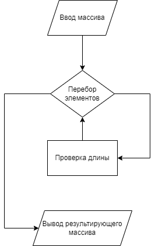

## Программа, проверяющая массив из строк на соответствие заданной условием длине строки.

Алгоритм:

Ввод данных осуществяется прямым присваиванием значений массива, но добавлен код для ввода данных с клавиатуры (закомментирован).

Перебор элементов массив производится с помощью стандартного цикла **forearch**.
В цикле мы проверяем соответствие условию (длина <= 3) и при выполнении условия, включаем элемент исходного массива в результирующий.

Выводим полученный результирующий массив поэлементно с помощью цикла **for**.

Перебор элементов массива и вывод оформлены в виде методов.